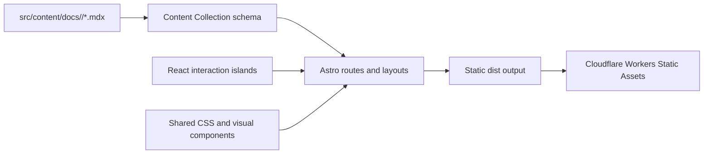

# Codex 101

一个使用 Astro、React 与 MDX 构建的多语言 ChatGPT / Codex 学习与文档站。

- 线上地址：<https://codex101-docs.runningpig.workers.dev/>
- 默认语言：简体中文
- 当前状态：公开预览与持续打磨
- 部署方式：Astro 静态构建 + Cloudflare Workers Static Assets

> [!NOTE]
> 这是一个非官方学习项目，与 OpenAI 不存在隶属或授权关系。ChatGPT、Codex、OpenAI 及相关商标归其权利人所有。

## 项目目标

Codex 101 希望提供一个易读、易维护、可持续扩展的中文学习入口：

- 首页负责介绍 ChatGPT 与 Codex 的主要使用场景。
- 文档区负责承载入门、配置、开发、安全和管理等结构化内容。
- 内容使用 MDX 管理，让正文保持接近 Markdown，同时允许少量受控交互组件。
- Astro 负责静态路由、SEO 和内容渲染；React 只承担必须在浏览器运行的交互。
- 所有语言共享同一套内容 schema、路由系统、布局和视觉原语。

视觉与信息架构主要参考：

- [ChatGPT Learn](https://learn.chatgpt.com/)
- [Codex Docs](https://www.codex-docs.com/docs)
- [Astro 官方文档](https://docs.astro.build/)

## 当前能力

- Astro 静态生成首页、文档首页和多层级文档路由。
- 基于 Content Collections 的 MDX 内容管理和 frontmatter 校验。
- 简体中文、英文、繁体中文、日语、韩语等 13 种语言路由。
- 自动生成顶部导航、左侧目录、页面顺序和搜索索引。
- 文档搜索、移动端导航、语言切换、主题切换等 React 交互岛。
- 支持文章页、Hub 页、产品页和特殊布局页面。
- Astro ClientRouter 驱动的轻量文档路由切换动效。
- 深色模式、移动端布局和键盘可访问性。
- 构建阶段自动验证参考路由覆盖与中文正文站内链接。
- 通过 Wrangler 发布到 Cloudflare Workers Static Assets。

## 技术栈

| 层级 | 实现 |
| --- | --- |
| 应用框架 | Astro 7 |
| 交互组件 | React 19 |
| 内容系统 | Astro Content Collections + MDX |
| 数据校验 | Zod（由 `astro/zod` 提供） |
| 图标 | Lucide React |
| 样式 | 原生 CSS、自定义设计 token、响应式媒体查询 |
| 路由与多语言 | Astro 文件路由 + Astro i18n |
| 部署 | Cloudflare Workers Static Assets + Wrangler 4 |
| 语言与类型 | TypeScript / ESM |

## 架构



核心边界：

- **MDX 是内容事实源**：标题、slug、导航归属、顺序和翻译状态都维护在 frontmatter 中。
- **Astro 是页面渲染层**：正文默认不进入客户端 JavaScript。
- **React 是交互层**：仅用于搜索、抽屉、选择器和需要状态的组件。
- **共享组件是视觉层**：复杂展示使用 `src/components/docs` 中的受控组件，不在单篇文章里堆一次性样式。
- **Cloudflare 只托管构建产物**：当前没有 SSR、数据库或 Worker 业务入口。

更完整的技术决策、页面模型、CSS 维护边界和 CMS 演进策略见 [`doc/tech.md`](doc/tech.md)。

## 环境要求

- Node.js `>= 22.12.0`
- npm
- 部署时需要已登录的 Cloudflare Wrangler

安装依赖：

```bash
npm ci
```

## 本地开发

按照项目约定，开发服务器使用 Astro 后台模式启动：

```bash
npx astro dev --background
```

默认地址：<http://127.0.0.1:4321/>

管理后台服务器：

```bash
npx astro dev status
npx astro dev logs
npx astro dev stop
```

## 常用命令

| 命令 | 用途 |
| --- | --- |
| `npm run check` | 运行 Astro 类型与内容诊断 |
| `npm run build` | 构建静态站点，并检查路由及内部链接 |
| `npm run check:reference-routes` | 单独检查参考路由与中文正文链接 |
| `npm run preview` | 本地预览 `dist` 生产构建 |
| `npm run deploy` | 重新构建并部署到 Cloudflare |

提交代码前至少运行：

```bash
npm run check
npm run build
```

## 路由与多语言

简体中文是默认语言，不使用语言前缀：

| 页面 | 示例 |
| --- | --- |
| 中文首页 | `/` |
| 中文文档首页 | `/docs` |
| 中文正文 | `/docs/quickstart` |
| 英文首页 | `/en/` |
| 英文正文 | `/en/docs/quickstart` |
| 日文正文 | `/ja/docs/quickstart` |

当前支持：

| locale | 语言 |
| --- | --- |
| `zh` | 简体中文（默认） |
| `en` | English |
| `zh-TW` | 繁体中文 |
| `ja` | 日本語 |
| `ko` | 한국어 |
| `ru` | Русский |
| `es` | Español |
| `fr` | Français |
| `de` | Deutsch |
| `pt` | Português |
| `id` | Bahasa Indonesia |
| `vi` | Tiếng Việt |
| `tr` | Türkçe |

语言列表同时受以下位置约束：

- `astro.config.mjs`
- `src/content.config.ts`
- `src/lib/site.ts`
- `src/lib/docs.ts`
- `src/content/docs/<locale>`

添加新语言前应先阅读 [`doc/tech.md`](doc/tech.md) 中的多语言维护清单，避免只增加路由但遗漏 UI 文案或内容 schema。

## 编辑和新增文档

文档位于：

```text
src/content/docs/<locale>/<slug>.mdx
```

例如：

- `src/content/docs/zh/quickstart.mdx`
- `src/content/docs/en/quickstart.mdx`
- `src/content/docs/ja/quickstart.mdx`
- `src/content/docs/zh/config-file/config-basic.mdx`

### Frontmatter 契约

每篇文档都需要通过 `src/content.config.ts` 的 schema 校验。典型示例：

```mdx
---
title: 快速开始
navTitle: 快速开始
description: 安装 Codex，并完成第一次任务。
locale: zh
translationKey: quickstart
section: start
order: 10
draft: false
translationStatus: complete
lastUpdated: 2026-08-07
pageKind: article
sourceUrl: https://example.com/source
---

这里开始编写正文。
```

重要字段：

- `translationKey`：同一页面不同语言必须保持一致，用于建立翻译关系。
- `section`：决定页面所属导航分组。
- `order`：决定同一分组中的排序。
- `draft`：为 `true` 时不生成公开页面，也不会进入导航与搜索。
- `translationStatus`：使用 `complete`、`needs-review` 或 `outdated` 标记翻译状态。
- `lastUpdated`：内容实际更新日期。
- `pageKind`：支持 `article`、`hub`、`product` 和 `special`。
- `referenceHub`：用于 features、configuration、developers、security-administration、administration 等参考栏目。

### 内容维护原则

1. 正文优先使用标准 Markdown。
2. 需要步骤、提示、截图、产品模块或交互时，复用 `src/components/docs` 中的 MDX 组件。
3. 不要在正文文件中维护另一份导航数组；导航由 frontmatter 自动生成。
4. 翻译页面必须复用原页面的 `translationKey` 和 slug 层级。
5. 修改内容后同步更新 `lastUpdated` 与 `translationStatus`。
6. 完成后运行 `npm run check` 和 `npm run build`。

## 目录结构

```text
.
├── doc/
│   └── tech.md                    # 长期技术架构和维护决策
├── public/
│   ├── fonts/                     # 本地字体
│   └── images/                    # 本地图片与媒体资源
├── scripts/
│   ├── check-reference-routes.mjs # 路由和链接完整性检查
│   └── reference-*.mjs            # 内容迁移辅助脚本
├── src/
│   ├── components/
│   │   └── docs/                  # MDX 可复用视觉组件
│   ├── content/docs/              # 按 locale 组织的 MDX 内容
│   ├── layouts/                   # 基础与文档布局
│   ├── lib/                       # 内容查询、导航、i18n 与站点数据
│   ├── pages/                     # Astro 文件路由
│   ├── styles/global.css          # 全局设计系统与响应式样式
│   └── content.config.ts          # Content Collection schema
├── astro.config.mjs               # Astro、MDX、React 与 i18n 配置
├── design-qa.md                   # 设计验收摘要
├── package.json
└── wrangler.jsonc                 # Cloudflare Static Assets 配置
```

`.design/` 保存本地视觉回归截图、PDF 和源站对照资料，体积较大且不属于运行时源码，因此不会提交到 Git。

## 搜索、导航与页面顺序

`src/lib/docs.ts` 从 Content Collection 读取文档并派生：

- 顶部导航
- 左侧文档导航
- 文档概览分组
- 上一篇 / 下一篇
- 搜索数据

因此调整标题、导航标题、分组或顺序时，只修改对应 MDX frontmatter。不要在 React 或 Astro 组件中再维护一套 slug 列表。

## 样式与交互维护

- 全局设计 token、页面布局、深色模式和响应式规则位于 `src/styles/global.css`。
- 文档组件负责自己的结构和状态，正文不使用一次性 class 修补布局。
- React 组件只负责状态与事件，不负责渲染静态文章正文。
- 路由动效仅作用于文档正文，避免 Header、Sidebar 和页面背景整体闪烁。
- 新交互需要支持键盘、焦点状态与 `prefers-reduced-motion`。
- 桌面和移动端都必须验证 `scrollWidth === clientWidth`，避免横向溢出。

## 构建与质量检查

`npm run build` 会执行两个阶段：

1. `astro build`：校验内容并生成所有静态页面。
2. `check:reference-routes`：检查导航可见路由是否真实生成，并扫描中文文档中的站内链接。

如果页面在导航中存在但缺少对应 MDX 文件，或正文链接指向不存在的路由，构建会失败。不要通过跳过检查发布不完整站点。

## Cloudflare 部署

站点使用 asset-only Workers Static Assets，不需要 Astro SSR adapter。相关配置位于 `wrangler.jsonc`：

- Worker 名称：`codex101-docs`
- 静态目录：`./dist`
- HTML 处理：`auto-trailing-slash`
- 404 策略：`404-page`

首次部署前检查登录状态：

```bash
npx wrangler whoami
```

正式发布：

```bash
npm run deploy
```

发布后验证：

- <https://codex101-docs.runningpig.workers.dev/>
- <https://codex101-docs.runningpig.workers.dev/docs/>
- 至少一个多语言页面，例如 `/en/docs/quickstart/`
- 桌面和移动端导航、搜索、主题及语言切换

## 公开仓库说明

当前仓库已设置为 Public，但暂未添加开源许可证。公开可见不等于授予复制、修改或再分发权；在许可证和第三方内容边界明确前，项目仍以学习、预览与持续打磨为主。

正式作为开源项目推广或接受外部贡献前，建议完成：

- 确认所有图片、字体、文案和参考内容的授权或合理使用边界。
- 添加合适的开源许可证；在此之前不要默认视为可复制或再分发。
- 检查品牌名称、商标说明和非官方项目声明。
- 扫描提交历史，确认没有密钥、个人信息或内部调试资料。
- 确认 `.design/`、`.wrangler/`、构建产物和环境变量仍处于忽略状态。
- 补充贡献规范、Issue 模板和公开路线图。

## 进一步阅读

- [`doc/tech.md`](doc/tech.md)：内容架构、页面模型、MDX 组件、多语言、视觉维护、CMS 和部署决策。
- [`design-qa.md`](design-qa.md)：设计对齐和浏览器验收摘要。
- [Astro 路由](https://docs.astro.build/en/guides/routing/)
- [Astro Content Collections](https://docs.astro.build/en/guides/content-collections/)
- [Astro React 集成](https://docs.astro.build/en/guides/integrations-guide/react/)
- [Astro 国际化路由](https://docs.astro.build/en/guides/internationalization/)
- [Cloudflare Workers Static Assets](https://developers.cloudflare.com/workers/static-assets/)
