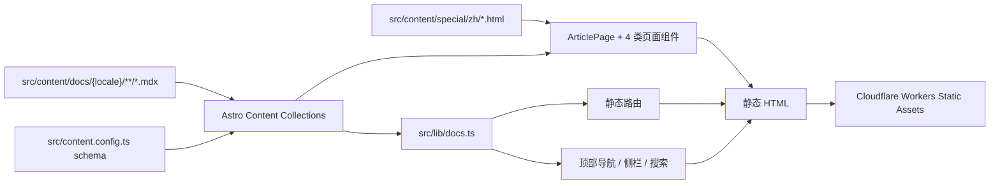

# Codex 101 技术架构

本文档记录站点的长期维护边界和关键技术决策。目标是在保留当前自定义视觉与交互的前提下，让文档内容、多语言、导航和路由可以独立演进。

## 设计目标

1. **内容与界面分离**：编辑文章不需要修改 Astro 或 React 组件。
2. **单一事实来源**：文章标题、描述、排序、路由和正文都由对应 MDX 文件提供。
3. **多语言可追踪**：每种语言有独立文件，并通过稳定的 `translationKey` 建立对应关系。
4. **静态优先**：所有文档在构建时生成，保持部署简单、页面快速且易于缓存。
5. **保留设计控制权**：继续使用自定义 Astro 布局和 React 岛，不引入会约束现有 1:1 视觉的文档主题框架。
6. **CMS 可渐进接入**：Git 和 MDX 始终是内容源，未来的 CMS 只作为编辑界面。

## 总体架构



页面主体由 Astro 静态生成。React 仅用于搜索弹窗、语言菜单、主题切换和移动端抽屉等需要浏览器状态的交互，避免把整页文档变成客户端应用。

## 目录职责

```text
src/
├── content.config.ts          # 文档集合 schema
├── content/docs/              # 文章内容，按 locale 镜像目录
│   ├── zh/
│   ├── en/
│   ├── ja/
│   └── …                      # 共 13 个 locale
├── content/special/zh/        # 确定性生成的复杂参考页 HTML 片段
├── components/docs/           # MDX 可使用的受控视觉组件
├── lib/docs.ts                # 集合查询、导航与文档 UI 标签
├── lib/reference-sidebars.ts  # 五个产品上下文 Hub 的源站信息架构
├── lib/site.ts                # 站点级和界面级短文案
├── pages/docs/                # 默认语言静态路由
├── pages/[lang]/docs/         # 其他语言静态路由
└── styles/reference-*.css     # 作用域隔离后的参考页/产品页样式
public/images/                 # 从源站取得并保留尺寸的真实产品资产
.design/reference/             # 源站结构和测量结果，仅用于复刻依据
.design/qa/                    # 同视口源站/本地截图与并排对比
scripts/reference-*.mjs        # HTML→MDX、特殊页生成与参考 CSS 提取
wrangler.jsonc                 # Cloudflare Workers Static Assets 配置
```

内容正文不能重新放回 `src/lib/site.ts`。该文件只负责首页和全局界面的短文案；文章数据属于 `src/content/docs`。

## Content Collection schema

每篇 MDX 必须包含以下 frontmatter：

```yaml
---
title: "快速开始"
description: "页面摘要，用于首屏和 SEO。"
locale: "zh"
translationKey: "quickstart"
section: "start"
order: 1
draft: false
translationStatus: "complete"
lastUpdated: 2026-08-06
pageKind: article
referenceHub: "features"
sourceUrl: "https://www.codex-docs.com/docs/projects"
outline:
  - id: "setup"
    label: "设置"
---
```

字段约定：

- `title`：页面标题和搜索结果标题。
- `navTitle`：可选。仅当参考站的页面标题与侧栏、概览或上一篇/下一篇文案不同（例如 `Skills 与 Plugins` 与 `技能与插件`）时声明；不填写时自动回退到 `title`。
- `description`：页面摘要和 meta description。
- `locale`：必须是站点支持的 13 种语言之一。
- `translationKey`：跨语言稳定 ID，同时作为文档 URL slug；不要使用翻译后的标题生成。
- `section`：`top`、`start`、`foundations`、`explore`、`available` 或 `releases`。
- `order`：同一 section 内的排序，必须是正整数。
- `draft`：为 `true` 时不生成页面，也不进入导航和搜索。
- `translationStatus`：`complete`、`needs-review` 或 `outdated`。
- `lastUpdated`：内容最后修改日期，不代表构建日期。
- `pageKind`：`article`、`hub`、`product` 或 `special`；未填写时默认 `article`。
- `referenceHub`：可选。用于归属“功能 / 配置 / 开发者 / 安全 / 管理”五个源站上下文；这类页面不进入普通文档概览，但仍进入搜索。
- `sourceUrl`：可选。记录迁移内容的来源页面，便于审校和后续有意同步；它不是运行时依赖。
- `outline`：可选。只在正文使用 JSX 结构、Astro 无法自动提取二级标题时声明；普通 Markdown 标题仍自动生成目录。

`src/content.config.ts` 在构建时校验这些字段。`src/lib/docs.ts` 还会验证文件路径是否与 `locale/translationKey` 一致，避免页面 URL、翻译关系和文件位置悄悄分叉。

## 路由约定

默认语言是简体中文，不使用语言前缀：

```text
src/content/docs/zh/quickstart.mdx
→ /docs/quickstart
```

其他语言保留前缀：

```text
src/content/docs/en/quickstart.mdx
→ /en/docs/quickstart

src/content/docs/ja/codex/cli.mdx
→ /ja/docs/codex/cli
```

文件路径、`translationKey` 和 URL slug 必须保持一致。`zh-TW` 在 URL 和 frontmatter 中保留 BCP 47 大小写；Astro 内部生成的小写 entry ID 只用于集合校验，不作为公开 URL。

## MDX 写作边界

正文优先使用标准 Markdown：标题、段落、列表、链接和代码块都不要写成 JSX。只有需要既有视觉模式时才使用受控组件：

```mdx
<Callout title="先从一个真实结果开始">

把希望得到的结果直接写进任务。

</Callout>

<Example>

“检查这个 Astro 站点，并验证移动端结果。”

</Example>

<Checklist items={["构建通过", "移动端可用"]} />
```

可用组件由 `ArticlePage.astro` 统一注入，目前包括：

- `Callout`：提示和重要说明。
- `Example`：Codex 示例任务卡片。
- `Checklist`：完成检查列表。
- `WorkflowSteps`：带编号圆点的任务流程。
- `Screenshot`：带真实产品截图的渐变展示面板。
- `Note`：无标题的信息提示。
- `Toggle`：可展开的原生 `details/summary` 内容。
- `ChatComposer`：文档中的 ChatGPT 输入框示意。
- `LinkCards`：下一步链接卡片组。
- `LinkCard`：可单独插入正文的来源或设置入口卡片。
- `Video`：点击后才设置 `src` 的延迟加载视频，避免首屏下载大体积媒体。
- `PromptCard`：带复制按钮的完整示例提示词。
- `CodeBlock`：不带标题、但保留复制行为的文本代码块。
- `WorkUseCases`：ChatGPT Work 使用场景的响应式卡片网格。
- 普通 Markdown 有序列表保留十进制列表语义；只有显式使用 `WorkflowSteps`，或迁移内容中标记为 `doc-workflow-steps` 的列表，才显示圆形步骤编号。

不要在单篇 MDX 中直接导入业务组件或添加页面级 CSS。新的内容组件必须先放进 `src/components/docs`，确认适合复用且在浅色、深色、桌面和移动端都通过后，再加入全局映射。

这些通用组件对所有 locale 开放，不按语言或单篇 slug 注册。语言文件只决定是否使用组件；组件映射本身不能复制成中文、英文两份。只有真正具有独立页面骨架的模板才允许按 `translationKey` 分流。

### 四类页面模型

同一个 Content Collection 通过 `pageKind` 支持四类维护方式，路由、SEO、翻译关系和导航元数据仍由 MDX frontmatter 统一管理：

| `pageKind` | 内容职责 | 渲染组件 | 适用页面 |
| --- | --- | --- | --- |
| `article` | 标准 Markdown 正文，少量受控 MDX 组件 | `ArticlePage` | 入门、基础文章、表格页 |
| `hub` | 在 MDX 中维护 hero、分组、链接等结构化数据 | `DocHubPage` | 功能、配置、开发者、安全、管理 |
| `product` | 在 MDX 中维护产品 hero、步骤、媒体和 CTA 数据 | `DocProductPage` | App、Web、CLI、IDE、Cloud |
| `special` | MDX 只保留可编辑元数据和稳定路由，正文使用确定性生成片段 | `DocSpecialPage` | 最新动态、更新日志、模型、定价、术语表 |

这不是四套路由系统。`ArticlePage.astro` 是统一入口，先读取 collection entry，再根据 `pageKind` 选择共享渲染器。普通编辑者仍从对应 `.mdx` 文件进入；复杂页面的结构化输入不会散落到 React 组件、路由文件或全局配置里。

### 复杂页面模板

1:1 复刻不要求把所有页面压成同一种文章模板。简单正文继续使用标准 Markdown；像“快速开始”这样包含产品卡片、选项卡、步骤和提示词选择器的页面，结构和文案仍放在 MDX，行为由共享 Astro 组件提供：

- `QuickstartPromptPicker.astro`：只负责提示词选择、键盘导航和复制状态。
- `QuickstartBehavior.astro`：只负责桌面 App / Web 选项卡状态。
- `global.css` 的 `.quickstart-v2*`：统一负责源站对齐后的桌面、移动端、浅色和深色视觉。
- `DocsOverviewIllustration.astro`：文档概览页的可响应产品窗口；使用真实壁纸资产和语义 HTML，避免把整个首屏锁死成一张不可维护截图。

页面特有的真实文案、链接、步骤与提示词不写进组件源码，避免以后改内容时同时修改 TypeScript。由 Google Ads 等第三方脚本随机插入的广告不属于产品设计系统，也不作为复刻或视觉回归基线。

### 长文档的可维护迁移

像“提示词”页这样包含几十个代码块和多层步骤的长文档，不手工复制 DOM。先把 Ego Lite 保存的 `.doc-content` HTML 放到 `.design/reference`，再用 `scripts/reference-html-to-mdx.mjs` 转成受控 MDX：

- 标题保留源站显式 `id`，旧锚点使用零高度 alias span，避免外链失效。
- 段落、普通列表、强调、行内代码和链接仍生成语义 HTML/MDX，不把正文变成 JSON。
- 源站代码块转换为 `CodeBlock`，并保留 `text` / `bash` 等语言信息。
- 步骤列表、单链接卡片和深浅色截图转换为已有视觉原语，不复制源站运行时代码。
- 转换结果必须进入 `src/content/docs/{locale}` 并接受人工审阅；脚本是降低遗漏率的迁移工具，不是线上内容源。

`CodeBlock` 按换行符渲染独立 `.line`，与 Shiki 输出结构一致。空行自然折叠，长行按容器宽度换行，因此桌面和移动端都能复现源站代码块高度。复制事件在 `ArticlePage.astro` 中统一注册一次；组件只输出 `data-copy-prompt`，避免一篇文章的 40 个代码块重复注入 40 份脚本。

### 特殊页面的确定性生成

“最新动态”“更新日志”“模型”“定价”“术语表”包含大量表格、筛选器、标签页或源站特有 utility class。把它们逐段手抄成 JSX 会同时降低准确度和可维护性，因此采用“可复现生成物”策略：

1. Ego Lite 将源站 `.docs-page-content` 与样式表保存在 `.design/reference/codex-docs`。
2. `scripts/reference-special-to-mdx.mjs` 移除脚本、广告和不稳定的内联高度，生成 `src/content/special/zh/*.html`，并保留原 MDX 的 locale、section、order 与翻译状态。
3. `scripts/extract-reference-page-css.mjs` 按选择器抽取需要的 CSS；`scripts/extract-prefixed-reference-css.mjs` 再加页面作用域，避免特殊页 utility class 污染普通文章。
4. `DocSpecialPage.astro` 只注入已审阅片段，并重新挂载标签页、术语筛选、复制等必要行为；线上不抓取源站，也不执行源站脚本。
5. 源站设计变化时重新执行生成脚本，审阅 HTML/CSS diff，再跑整页并排回归。生成文件必须提交，它们是可审阅的构建输入，而不是缓存。

这种做法保留了像素级结构和可重复升级路径，同时把源站运行时代码、广告与网络可用性排除在生产依赖之外。

## 设计系统分层

1:1 复刻采用三层结构，避免单页修正污染其他文章：

```text
全局壳层
  Header / Sidebar / Outline / Search / Theme / Locale
        ↓
文章基础层
  .docs-page-content > .doc-content 的标题、段落、列表、表格节奏
        ↓
视觉原语与页面模板层
  .doc-screenshot / .doc-toggle / .doc-link-card / .quickstart-v2*
```

- **全局壳层**只处理所有路由共享的网格、导航和交互，不能包含某篇文章的文案。
- **文章基础层**只定义标准 Markdown 输出，选择器必须直接限定在 `.docs-page-content > .doc-content`，避免影响快速开始等自定义模板。
- **视觉原语层**拥有自己的尺寸、间距和状态。通用列表规则不能覆盖 `WorkflowSteps`，通用图片规则不能拉伸 `Screenshot` 内的真实产品图。
- **页面模板层**只在结构确实不同且源站有对应设计时存在；它仍从 MDX 接收内容，不把正文硬编码进 Astro。

CSS 的声明顺序是维护契约：基础文章规则在前，视觉原语修正规则在后；移动端对视觉原语的覆盖放在该原语之后。新增规则前先检查继承和 specificity，禁止用 `!important` 或不断叠加 slug 选择器修复串扰。

透明产品截图是一个典型例子：深色主题的通用 `img` 背景不能覆盖 `Screenshot` 内的透明 WebP，否则真实渐变会变成黑色矩形。这里使用更明确的组件选择器恢复 `background: transparent`，而不是修改资产或增加页面 slug 特例。

## 视觉复刻与回归流程

每个页面都按同一流程完成，不以“看起来接近”作为验收：

1. 使用 Ego Lite 在源站采集桌面和 390px 移动视口，记录主容器、标题、关键组件和页面总高度。
2. 移除源站随机插入的 Google Ads；它们不是设计基线。
3. 获取源站真实图片资产，保留像素尺寸、宽高比、边框和裁切方式，不用占位图或 CSS 近似图替代。
4. 在 MDX 中复刻语义和内容，在 Astro 视觉原语中复刻结构，在共享 CSS 中复刻外观。
5. 对源站和本地使用相同视口、主题和交互状态生成整页图，并制作单张并排对比图。
6. 先修 P0/P1 的结构、溢出、缺失资产和交互，再修字体、间距、圆角、边框等 P2 视觉误差。
7. 验证展开/收起、选项卡、提示词选择、导航、搜索、语言与主题状态；移动端必须确认 `scrollWidth === clientWidth`。

允许保留的误差只有浏览器字体栅格化导致的亚像素差异。关键节点出现连续纵向偏移时，应定位首个产生高度差的元素，不能在后续标题上补负 margin。

视觉回归产物放在 `.design/qa/codex-docs`。命名使用：

```text
source-{slug}-{viewport}.png
local-{slug}-{viewport}.png
compare-{slug}-{viewport}.png
```

`compare-*` 必须把源站和本地放进同一张图后再评审；单独看两张截图不算完成视觉 QA。

## 资产策略

- 能从源站取得的可见产品截图、壁纸和插图必须保存到 `public/images`，页面不依赖源站运行时 URL。
- MDX 只保存资产 URL、替代文本和原始尺寸；渐变容器、边框、内边距与响应式行为由 `Screenshot` 等组件负责。
- 同一产品图有浅色/深色版本时由 `Screenshot` 输出原生 `<picture>`；内容文件同时声明 `src` 与 `darkSrc`，主题切换不依赖客户端 JavaScript。
- 产品 UI 截图使用 `height: auto` 和真实宽高比；容器负责限制最大宽高，不能同时把宽和高强行拉满。
- 源站本身托管在 OpenAI CDN、单个几十 MB 的视频不复制进 Git；`Video` 保留官方 CDN URL，并在用户点击前使用 `preload="none"`。产品截图和壁纸体积较小且属于页面稳定外观，应本地化保存。
- 图标优先使用项目现有图标库；只有源站已有且无法由库图标表达的品牌资产才保存为独立文件。
- 第三方广告、追踪像素、浏览器扩展注入内容和临时 A/B 测试占位不进入仓库。

## 导航、目录和搜索

常规文档导航不能再维护第二份 slug/title 数组：

- 顶部导航来自 `section: top` 的 MDX 元数据。
- 左侧导航和文档概览来自其余 section。
- 搜索候选来自同一集合。
- 右侧页内目录来自 MDX 的二级标题。
- “下一篇”根据集合 section 和 order 自动计算。

因此，调整标题、导航标题或排序只修改 MDX frontmatter；不需要同步修改 React、侧栏或路由文件。

五个中文上下文 Hub 是明确的内容分区。源站“功能 / 配置 / 开发者 / 安全 / 管理”的 105 个可见详情路由已迁移为分层 MDX；另外迁移两篇只被正文引用的补充页面，避免文章内部链接再次产生 404。

- `src/lib/reference-sidebars.ts` 只保存源站可见的信息架构，同时供桌面侧栏和移动抽屉消费。
- 详情 MDX 通过 `referenceHub` 声明归属。普通文档概览和上一篇/下一篇不会被 100 多篇参考页淹没，但搜索包含全部内容。
- 参考详情页的侧栏、顶部当前上下文和上一篇/下一篇都从同一个 reference tree 推导；不能再单独维护第三份路径数组。
- `npm run build` 会在 Astro 构建后执行 `check:reference-routes`，同时检查 110 个可见导航路由和全部中文正文站内链接；任何缺页都会让构建失败。

源站快照迁移入口是：

```bash
# 只解析并报告，不写文件
npm run migrate:reference-docs

# 明确接受覆盖已有来源快照时才写入 MDX 与本地资产
npm run migrate:reference-docs -- --write
```

迁移器把 Shiki 渲染 HTML 还原为 `CodeBlock`、把图片还原为 `Screenshot`、把提示框和表格还原为语义 MDX，并过滤广告和装饰性脚本。运行时不请求 `codex-docs.com`；正文图片保存在 `public/`。日常编辑直接修改 MDX，不能把迁移命令当作自动同步任务，否则会覆盖已经人工审校的来源快照。

当前搜索是构建时注入标题的轻量客户端过滤，适合现阶段文档规模。正文全文搜索需求出现后，优先接入 Pagefind；只有索引规模、分析能力或跨站搜索超过 Pagefind 能力时再考虑托管搜索。

## 多语言维护

核心教程采用镜像目录，每个 `translationKey` 应有 13 个对应文件。当前非中英文初始内容标记为 `needs-review`，表示页面可用但仍需要母语审校。

五个参考 Hub 的详情语料来自中文源站，当前以简体中文作为唯一可审校的 canonical snapshot。详情页切换到其他语言时落到目标语言对应 Hub，而不是生成一个不存在的翻译 URL 或展示伪翻译。某个参考详情完成母语翻译后，再在目标语言目录创建相同 `translationKey`，并把语言切换策略升级为基于 collection 实际可用性选择同页链接。

翻译流程：

1. 先更新源语言文件和 `lastUpdated`。
2. 将其他语言同一 `translationKey` 标记为 `outdated`。
3. 翻译正文和 frontmatter，但不修改 `translationKey`、`section` 和既有 URL。
4. 人工审校后改为 `complete`。
5. 运行 `npm run check` 和 `npm run build`。

增加新语言时，必须同步更新：

- `astro.config.mjs` 的 i18n locales。
- `src/lib/site.ts` 的 locale、名称与 UI 短文案。
- `src/content.config.ts` 的 locale enum。
- `src/lib/docs.ts` 的文档 UI 标签。
- `src/content/docs/{locale}` 的完整镜像内容。

## 视觉维护原则

- MDX 只描述内容语义，视觉由 `global.css` 和受控文档组件负责。
- 文章宽度、排版、分隔线、步骤、提示卡和下一篇导航保持在共享样式中。
- 不能为了单篇文章增加一次性 class；先判断是否应抽象为可复用内容组件。
- React 只处理交互，不负责文章正文渲染。
- 新组件必须支持 `prefers-reduced-motion`，并验证深色模式与键盘操作。

### 首页 Hero

首页 Hero 不再把所有访问者导向同一条“快速开始”路线，而是在统一的价值主张之后，明确提供“无需编程基础”和“开发者”两条最短路径。结构参考身份选择式文档首页，但内容、链接和术语必须来自 Codex 101 自身的信息架构。

- 首屏上半部分只负责说明 Codex 能为谁解决什么问题，并保留“快速开始 / 文档”两个全局入口；不要在这里堆叠产品截图或功能卡片。
- 下半部分使用一个共享边框容器承载两种身份，桌面端等宽双栏、767px 以下纵向堆叠。两条路径属于同一个决策，不拆成互不相关的浮层卡片。
- 非开发者路径优先链接 `get-started-with-work`、ChatGPT、Codex App 和 Skills；开发者路径优先链接 Developers、Quickstart、CLI 和 IDE。新增入口时必须先判断它属于哪类用户，不能把工具列表重新混在一起。
- 身份标题、行动文案属于站点级短文案，统一维护在 `src/lib/site.ts`，并为 13 个 locale 提供值；链接 slug 保持跨语言稳定，由 `localizedPath` 生成本地化 URL。
- Hero 保持中性编辑风格：大标题、细分隔线、轻边框和少量编号层级。禁止引入渐变、玻璃效果、厚阴影或大面积独立卡片，以免偏离文档站的冷静视觉。
- 验收至少覆盖 1440px、1023px 和 390px，检查浅色/深色、双栏到单栏切换、主按钮触控高度、两条主路径返回 200，以及 `scrollWidth === clientWidth`。

### 首页 Header

首页 Header 保持 64px 固定高度与三段式网格：左侧品牌锚点、中间主导航、右侧操作区。桌面端左右安全距离为 24px，主导航必须相对视口居中，不随不同语言的按钮长度或右侧操作区宽度偏移。

- 导航项的视觉高度固定为 28px，使用 10px 水平内边距与 4px 项间距；不能让链接随 Header 的 64px 高度拉伸。
- 当前项使用中性浅底和 8px 圆角表达状态，不增加阴影、描边或更大的卡片面积。
- 非当前项悬停只改变文字与浅底色，避免位移和尺寸变化。
- 主操作按钮视觉高度为 36px；品牌和图标按钮仍保留约 40px 的可点击区域。
- 1024px 以下隐藏桌面导航并切换为抽屉菜单；移动端不能通过压缩文字强行保留完整横向导航。

### 路由切换动效

文档路由使用 Astro `ClientRouter` 提供客户端导航，但动画只绑定到 `DocsLayout` 的正文 `main`。顶部导航、侧栏和页内目录按新路由立即更新，不做整页位移或共享元素表演，避免长文档切换时产生视觉负担。

- 前进导航使用快速淡出和轻微上移，再以淡入和轻微上移进入；浏览器后退使用相反方向，帮助读者感知导航方向。
- 只动画 `opacity` 与 `transform`，退出约 120ms、进入约 220ms，整体不超过 260ms。
- `html` 根过渡显式设为 `none`，防止头部、背景和主题一起闪烁。
- `prefers-reduced-motion: reduce` 下把正文 View Transition 压缩为近乎即时切换。
- 页面级脚本必须通过 `astro:page-load` 可重复初始化；主题引导脚本使用 `data-astro-rerun`，保证客户端导航后仍保持当前主题。

## CMS 演进策略

当前阶段使用 Git + MDX + PR/Preview，这是依赖最少、历史最清晰的维护方式。

若出现非技术编辑需求，优先增加 Decap CMS 或同类 Git-backed 编辑器：编辑结果仍写回这些 MDX 文件，不改变页面读取逻辑。只有出现专职内容团队、细粒度角色权限、复杂审批、定时发布或资产工作流时，才评估 Sanity 等数据库型 headless CMS。

不允许同时把 Git MDX 和 CMS 数据库都当作主数据源，否则标题、路由、翻译状态和预览会产生双向同步问题。

## Cloudflare 部署

站点使用 Astro 静态输出，不需要 SSR adapter 或 Worker 入口文件。Cloudflare 采用 asset-only Workers Static Assets：

```jsonc
{
  "$schema": "./node_modules/wrangler/config-schema.json",
  "name": "codex101-docs",
  "compatibility_date": "2026-08-06",
  "assets": {
    "directory": "./dist",
    "html_handling": "auto-trailing-slash",
    "not_found_handling": "404-page"
  }
}
```

- `assets.directory` 只发布 `astro build` 生成的 `dist`。
- 不设置 `main` 或 Worker binding；静态文档不需要把每个请求交给 JavaScript。
- `auto-trailing-slash` 与 Astro 的目录型 HTML 输出一致，`/docs/app` 和 `/docs/app/` 都由资产层规范化。
- `_headers`、`_redirects` 如有需要放进 `public/`，随构建进入 `dist`；不要在 Astro 与 Cloudflare 维护两套相同规则。
- 发布命令是 `npm run deploy`，它必须先执行完整构建，再运行 `wrangler deploy`。
- 部署后用 Ego Lite 验证首页、默认语言深层路由、带语言前缀路由、静态图片与 404；不能只以 Wrangler 返回成功作为验收。

## 质量门禁

每次内容或架构修改至少执行：

```bash
npm run check
npm run build
```

`npm run build` 的成功条件包括 `Reference route coverage passed` 和 `Internal link coverage passed`，不能只看 Astro 编译成功。

发布前浏览器验证：

- 默认语言和至少一种带前缀语言可以打开。
- 嵌套路由如 `/docs/codex/cli` 可以生成。
- 侧栏当前项、顶部导航和搜索来自 MDX 标题。
- 二级标题生成正确的页内目录与锚点。
- 语言切换保持同一 `translationKey`。
- 桌面端无控制台错误，移动端无水平溢出。
- 浅色和深色主题中的 Callout、代码块、步骤和 Checklist 可读。
- 源站与本地同视口整页截图先等待图片解码、移除广告、解除 `content-visibility`，再生成 `compare-*`；避免把懒加载空白误判为实现差异。

## 关键取舍

- **没有直接采用 Starlight**：它能减少文档基础设施开发，但深度覆盖主题会增加升级成本，也会削弱当前 1:1 设计控制。
- **没有采用 CMS-first**：现阶段没有复杂编辑权限与审批需求，引入 API、预览 webhook 和数据库备份会增加维护面。
- **选择 MDX 而不是纯 Markdown**：大部分内容仍是 Markdown；MDX 只为少量受控交互/视觉组件提供扩展点。
- **选择按语言拆文件**：文件数量更多，但翻译 ownership、审校状态、Git diff 和未来 CMS 编辑都更清晰。

## 技术依据

- [Astro Content Collections](https://docs.astro.build/en/guides/content-collections/)
- [Astro MDX integration](https://docs.astro.build/en/guides/integrations-guide/mdx/)
- [Astro internationalization](https://docs.astro.build/en/guides/internationalization/)
- [Cloudflare Workers Static Assets](https://developers.cloudflare.com/workers/static-assets/)
- [Cloudflare Wrangler configuration](https://developers.cloudflare.com/workers/wrangler/configuration/)
